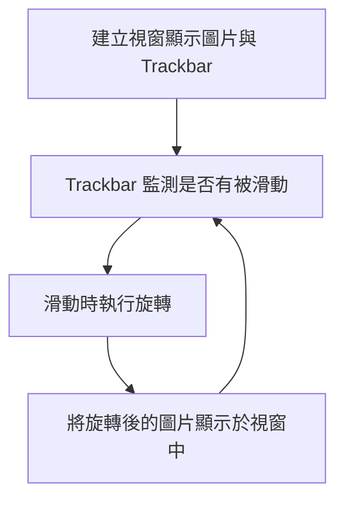
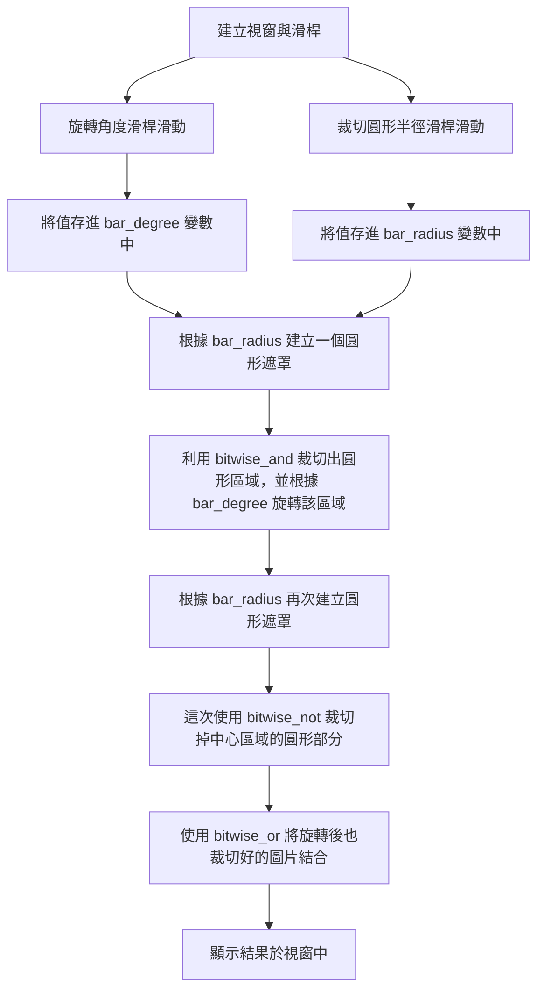

# Assignment 1

## 功課要求
撰寫一個程式將一張圖像的 <br>
(a)整張圖像 <br>
(b)中心內切圓區域 <br>
旋轉一個角度（逆時針旋轉 0 度至 359 度）：利用一個滑動條(trackbar)控制旋轉角度。

## 成果

_透過滑動滑桿調整整張圖片的旋轉角度_


_透過滑桿調整內切圓半徑與旋轉角度_

## 開發環境

| OS         | Editor             | Language      | OpenCV       |
|------------|--------------------|---------------|--------------|
| Windows 10 | Visual Studio Code | Python 3.9.16 | OpenCV 4.5.4 |

## 做法

> 本次程式碼： <br>
> [旋轉整張圖像](https://github.com/titaliu1224/Image-Processing/blob/main/assignment1/rotate.ipynb) <br>
> [旋轉中心圓形](https://github.com/titaliu1224/Image-Processing/blob/main/assignment1/crop-and-rotate.ipynb)

### 旋轉整張圖像

這個的想法非常簡單，取得特定圖像的旋轉矩陣後把整張圖片乘上旋轉矩陣後就好。



#### 旋轉圖像

所以我寫了一個 Function 好讓 Trackbar 可以重複執行旋轉的動作：
```py
def rotate_img(val):
    global origin_img, result_img
    (h, w, d) = origin_img.shape # 讀取圖片大小
    center = (w // 2, h // 2) # 找到圖片中心
    
    # 取得旋轉矩陣
    M = cv2.getRotationMatrix2D(center, val, 1.0)
    print(val)
    
    result_img = cv2.warpAffine(origin_img, M, (w, h))
    cv2.imshow("Rotate Image", result_img)
```

#### 建立 Trackbar

至於 Trackbar 的建立也非常簡單： <br>
利用 `imshow` 顯示目前的圖片，再使用 `createTrackbar` 在該視窗建立滑動條。 <br>
`createTrackbar` 的參數分別是 `滑桿名稱` , `視窗名稱` , `最小值` , `最大值` , `滑動時要執行的函式`

```py
cv2.imshow("Rotate Image", result_img)
cv2.createTrackbar("degree", "Rotate Image", 0, 359, rotate_img)
```

如此一來就建立了一個這樣的視窗：


_利用 imshow 和 createTrackbar 產生的 GUI 視窗_

### 旋轉中心圓形區域

切圓形實在不是那麼直觀，透過建立一個 Mask 作為遮罩，來協助我們裁切特定圖片區域。 <br>
流程圖如下：



#### 旋轉中心圓區域

首先必須先找到中心圓區域做旋轉： <br>
1. 利用 `np.zeros_like(origin_img)` 製作一個和原圖片相同尺寸的全黑圖片。（其中 `np` 為 `numpy`） <br>
2. 利用 `cv2.circle(img, center, radius, color, thickness)` 在剛剛的全黑畫布上畫一個實心白色圓形，生成一個圓形遮罩
  - `img` : 要用來畫圓的圖片
  - `center` : 圓心座標 (X, Y)
  - `radius` : 圓的半徑
  - `color` : 圓的顏色 (B, G, R)
  - `thickness` : 圓的框線粗細，以 px 為單位，設為 -1 會填滿整個圓

1. 把圓形遮罩拿來和原圖 `cv2.bitwise_and(src1, src2[, dst[, mask]])` 後，由於剛剛的圓形遮罩只有中心圓形部分有值（白色），所以進行 AND 後能得到原圖的中心圓形部分。
   - `src1` , `src2` : input
   - `dst` : output
   - `mask` : 指定要使用 `src1` 和 `src2` 的哪些位置來做運算，是一個 8-bit 單通道 array
   - 關於參數中的 `[]` ，那代表參數可以自行選擇要不要填，並非必要參數，可以參考 [這篇文章](https://blog.csdn.net/Dontla/article/details/101722486)  

1. 再來就能把這個圓形圖片丟到剛剛提到的旋轉函式裡了！

```py
def crop_circle(radius):
    global origin_img
    (h, w, d) = origin_img.shape # 讀取圖片大小
    center = (w // 2, h // 2)

    # 產生 mask
    mask = np.zeros_like(origin_img)
    mask = cv2.circle(mask, center, radius, (255,255,255), -1)

    # 取得圓形圖片
    crop = cv2.bitwise_and(origin_img, mask)

    return crop
```

#### 結合旋轉後的圓到原圖上

再來就是將旋轉完的圓形貼回原圖，這裡一樣要用到圓形遮罩來實現。
1. 像剛剛一樣畫一個黑底的白色圓形圖片
2. 使用 `cv2.bitwise_not(src[, dst[, mask]])` 將整個圖片的黑白翻轉，這樣就得到中心為黑色但四周為白色的遮罩。<br>
  
1. 使用 `cv2.bitwise_and(src1, src2[, dst[, mask]])` 擷取圖片外圍，並利用 `cv2.bitwise_or(src1, src2[, dst[, mask]])` 結合兩張圖片，產生最終結果。
  

```py
def combine_img(center_img, radius):
    global origin_img
    (h, w, d) = origin_img.shape # 讀取圖片大小
    center = (w // 2, h // 2)
    
    # 產生 mask
    mask = np.zeros_like(origin_img)
    mask = cv2.circle(mask, center, radius, (255,255,255), -1)
    mask = cv2.bitwise_not(mask)

    # 取得圓形圖片 
    crop = cv2.bitwise_and(origin_img, mask)

    # 結合兩張圖片
    combined_img = cv2.bitwise_or(center_img, crop)

    return combined_img
```

## 參考資料
- [howarder3/ironman2020_OpenCV_photoshop](https://github.com/howarder3/ironman2020_OpenCV_photoshop/blob/273e786aa3d7d5cc5f75326769a961c9212d83d8/Day03_%E5%9C%96%E7%89%87%E5%89%AA%E8%A3%81%E6%97%8B%E8%BD%89%E7%B8%AE%E6%94%BE_crop_rotate_resize.ipynb)
- [加入滑桿 ( Trackbar )](https://steam.oxxostudio.tw/category/python/ai/opencv-trackbar.html)
- [How to use OpenCV to crop circular image?](https://stackoverflow.com/questions/61516526/how-to-use-opencv-to-crop-circular-image)

# Assignment 2

## 功課要求
撰寫一個程式，以灰階模式讀取一張圖像  `imread(path, IMREAD_GRAYSCALE)`
1. 利用 Sobel Operators 偵測並輸出邊緣成分圖 
2. 設計一個類似素描線條的自畫像圖案。

## 成果


## 開發環境

| OS         | Editor             | Language      | OpenCV       |
|------------|--------------------|---------------|--------------|
| Windows 10 | Visual Studio Code | Python 3.9.16 | OpenCV 4.5.4 |

## 實作
> [本次程式碼](https://github.com/titaliu1224/Image-Processing/blob/main/assignment2/main.py)


使用的 library 如下：

```py
import cv2
import matplotlib.pyplot as plt
import numpy as np
```

### 1/ 讀取灰階圖片

`colored_img` 用以展示彩色的原圖，而 `cv2.imread(file_name, cv2.IMREAD_GRAYSCALE)` 會以灰階模式讀入一張圖。

```py
file_name = ".\\fig.jpg"
colored_img = cv2.imread(file_name)
gray_img = cv2.imread(file_name, cv2.IMREAD_GRAYSCALE)
```

和[上一個程式](/posts/image_crop_and_rotate/)不同，這次的圖片輸出如下： <br>
使用 `result_img` 儲存所有要顯示的圖片，一個個將他們貼到 `plt` 中，這裡帶入了 `plt.axis("off")` 隱藏 matplotlib 預設的 x 軸和 y 軸的刻度。

```py
result_img = [colored_img]

fig = plt.figure()
def show_img():
    for i in range(0, len(result_img)):
        image_rgb = cv2.cvtColor(result_img[i], cv2.COLOR_BGR2RGB)
        fig.add_subplot(2, 2, i + 1)
        plt.imshow(image_rgb)
        plt.axis("off")

    plt.show()
```

### 2/ 邊緣成分圖

首先利用高斯模糊 (Gaussian blur) 去除雜訊（噪聲），使邊界更好檢測： <br>

```py
# 高斯模糊協助過濾雜訊
gray_img = cv2.GaussianBlur(gray_img,(3, 3), 0)
result_img.append(gray_img)
```

再利用索伯算子 (Sobel operaters) 提取 x 方向和 y 方向的邊界，之後將兩者的絕對值相加，獲得完整的邊緣成分圖。

```py
# 提取 x 方向和 y 方向的邊緣
edge_x = cv2.Sobel(gray_img, cv2.CV_16S, 1, 0, 3)
edge_Y = cv2.Sobel(gray_img, cv2.CV_16S, 0, 1, 3)
# 轉換為 unit8 （提取絕對值）
abs_x = cv2.convertScaleAbs(edge_x) 
abs_y = cv2.convertScaleAbs(edge_Y)
# 將兩者取絕對值相加，獲得完整影像
edge_all = cv2.addWeighted(abs_x, 0.5, abs_y, 0.5, 0)
result_img.append(edge_all)
```

關於高斯模糊和索伯算子，日後我想寫篇文章給他們。

### 3/ 素描線條畫像

這裡簡單的使用 `bitwise_not()` 將邊緣成分圖黑白相反，使其看起來像素描：

```py
sketch_img = cv2.bitwise_not(edge_all)
result_img.append(sketch_img)
```

最後使用 `show_img()` 展示成果。

## 總結

本篇使用**高斯模糊**去除雜訊、**索伯算子**提取邊界、`bitwise_not()`進行黑白反轉。 <br>
邊界提取是很實用的東西，例如[分辨一張圖畫是寶可夢還是數碼寶貝](https://youtu.be/_j9MVVcvyZI?t=327) 等。

## 參考資料

- [Day12-當自動駕駛遇見AI-索伯算子(Sobel Operator)](https://ithelp.ithome.com.tw/articles/10205752)
- [邊緣偵測 - 索伯算子 ( Sobel Operator )](https://medium.com/%E9%9B%BB%E8%85%A6%E8%A6%96%E8%A6%BA/%E9%82%8A%E7%B7%A3%E5%81%B5%E6%B8%AC-%E7%B4%A2%E4%BC%AF%E7%AE%97%E5%AD%90-sobel-operator-95ca51c8d78a)
- [Opencv学习----Opencv宏定义(CV_8U、CV_8S、CV_16U...)](https://blog.csdn.net/charce_you/article/details/99616021)
- [程式語言-看盤版面(上)-圖框教學](https://medium.com/%E5%8F%B0%E8%82%A1etf%E8%B3%87%E6%96%99%E7%A7%91%E5%AD%B8-%E7%A8%8B%E5%BC%8F%E9%A1%9E/%E7%A8%8B%E5%BC%8F%E8%AA%9E%E8%A8%80-%E7%9C%8B%E7%9B%A4%E7%89%88%E9%9D%A2-%E4%B8%8A-%E5%9C%96%E6%A1%86%E6%95%99%E5%AD%B8-5d1baf57f5a7)
- [在 Matplotlib 中隱藏座標軸、邊框和空白](https://www.delftstack.com/zh-tw/howto/matplotlib/hide-axis-borders-and-white-spaces-in-matplotlib/)

# Assignment 3

## 功課要求

1. 撰寫傅利葉轉換程式 (Forward Fourier Transform and Inverse Fourier Transform) 將一張圖像轉換至頻域
2. 將頻譜大小與相位角度各以灰階256 色圖像方式呈現出
3. 呈現還原後圖像

## 成果


## 開發環境

| OS         | Editor             | Language      | OpenCV       |
|------------|--------------------|---------------|--------------|
| Windows 10 | Visual Studio Code | Python 3.9.16 | OpenCV 4.5.4 |

## 實作
> [本次程式碼](https://github.com/titaliu1224/Image-Processing/blob/main/assignment3/main.py)

使用的 libraries 如下：

```py
import cv2
import matplotlib.pyplot as plt
import numpy as np
```

### 1/ 讀取圖片並顯示

`cv2.imread(file_name, cv2.IMREAD_GRAYSCALE)` 會以灰階模式讀入一張圖。

```py
# Read image
original_img = cv2.imread(".\\image3.png", cv2.IMREAD_GRAYSCALE)
```

再使用 `plt` 創建一個 2*2 空間的畫布，並以灰階模式顯示，加上 title 和 axis off 讓他更美觀。

```py
plt.subplot(2, 2, 1)
plt.imshow(original_img, cmap='gray')
plt.title("Original Image")
plt.axis("off")
```

### 2/ 調整圖像大小

DFT 在某些大小的畫布下可以計算得比較快，所以我們透過在圖片的右方與下方插入白色畫布，拓展他的尺寸。 <br>
`getOptimalDFTSize()` 可以幫我們取得 x 軸和 y 軸所要調整的最佳大小。<br>
使用 `np.zeros()` 創建一個 dft_M * dft_N 大小的白色畫布，在畫布左上角用 `original_img` 覆蓋。

```py
# get optimal size for dft
dft_M = cv2.getOptimalDFTSize(original_img.shape[0])
dft_N = cv2.getOptimalDFTSize(original_img.shape[1])
# add zero padding
dft_A = np.zeros((dft_M, dft_N), dtype=np.float32)
dft_A[:original_img.shape[0], :original_img.shape[1]] = original_img
```

### 3/ 計算 DFT

由於 DFT 結果是複數，包含實部和虛部，所以使用二維 array `planes` 協助我們儲存。 <br>
利用 `cv2.dft()` 算 DFT 後，再使用 `cv2.split()` 將實部虛部兩個通道分開。 <br>
`cv2.magnitude(x, y)` 的原理是實部相乘 + 虛部相乘，公式為 $ dst(I) = \sqrt{x(I)^2 + y(I)^2}$ ，再來對它取 log。

```py
# make two channel for dft (real and imaginary)
planes = [dft_A, np.zeros(dft_A.shape, np.float32)]
dft_A = cv2.merge(planes)
cv2.dft(dft_A, dft_A)
cv2.split(dft_A, planes)
#compute the magnitude
magnitude = cv2.magnitude(planes[0], planes[1])
magnitude = np.log(magnitude + 1)
```

### 4/ 平移頻譜圖

頻譜圖有時候會需要平移一下，將重點放到圖片中心，好讓人類觀看，如果把四個角的亮部移到中心，我們會更好觀察，所以把原圖這樣切割：

```
| 0 | 1 |
| 2 | 3 |
```

若要將亮部移動到中心位置，就必須 0、3 互換， 1、2 互換。 <br>
這裡我選用了比較原始的方法， numpy 可以使用 [`ffshift` 函式](https://www.mathworks.com/help/matlab/ref/fftshift.html) 方便許多。<br>
最後用正規化便於我們顯示灰階圖片。

```py
# shift to center
cx = int(dft_A.shape[1] / 2)
cy = int(dft_A.shape[0] / 2)
q0 = magnitude[0:cy, 0:cx]
q1 = magnitude[0:cy, cx:dft_A.shape[1]]
q2 = magnitude[cy:dft_A.shape[0], 0:cx]
q3 = magnitude[cy:dft_A.shape[0], cx:dft_A.shape[1]]
# swap diagonal quadrants
tmp = np.copy(q0)
magnitude[0:cy, 0:cx] = q3
magnitude[cy:dft_A.shape[0], cx:dft_A.shape[1]] = tmp
tmp = np.copy(q1)
magnitude[0:cy, cx:dft_A.shape[1]] = q2
magnitude[cy:dft_A.shape[0], 0:cx] = tmp
cv2.normalize(magnitude, magnitude, 0, 1, cv2.NORM_MINMAX)
```
然後使用 `plt` 顯示圖片。

```py
# show frequency domain image after shift
plt.subplot(2, 2, 2)
plt.imshow(magnitude, cmap='gray')
plt.title("Frequency Domain Image After Shift")
plt.axis("off")
```

### 5/ 相位角度圖

相位角度通常用來描述圖片的輪廓與細節，這裡直接使用 `cv2.phase()` 來提取相角，再用和上一步一樣的方法進行平移。

```py
# get phase image
phase = cv2.phase(planes[0], planes[1], angleInDegrees=True)
# shift to center
q0 = phase[0:cy, 0:cx]
q1 = phase[0:cy, cx:dft_A.shape[1]]
q2 = phase[cy:dft_A.shape[0], 0:cx]
q3 = phase[cy:dft_A.shape[0], cx:dft_A.shape[1]]
# swap diagonal phase
tmp = np.copy(q0)
phase[0:cy, 0:cx] = q3
phase[cy:dft_A.shape[0], cx:dft_A.shape[1]] = tmp
tmp = np.copy(q1)
phase[0:cy, cx:dft_A.shape[1]] = q2
phase[cy:dft_A.shape[0], 0:cx] = tmp
cv2.normalize(phase, phase, 0, 1, cv2.NORM_MINMAX)
# convert to 8 bit unsigned integer
phase = phase * 255
phase = phase.astype(np.uint8)
# show phase image
plt.subplot(2, 2, 3)
plt.imshow(phase, cmap='gray')
plt.title("Phase Image")
plt.axis("off")
```

### 6/ 還原圖片

最後使用 DFT 得出的 `dft_A` 來還原圖片，使用 `cv2.idft()` 做反向的傅立葉轉換， `cv2.split()` 與 `cv2.magnitude()` 取得轉換後的影像， normalize 後就能以 unsigned 8 bits 的方式輸出灰階影像。

```py
# get inverse dft
cv2.idft(dft_A, dft_A)
cv2.split(dft_A, planes)
# get inverse image
inverse_img = cv2.magnitude(planes[0], planes[1])
# normalize to 0~255
cv2.normalize(inverse_img, inverse_img, 0, 255, cv2.NORM_MINMAX)
# convert to 8 bit unsigned integer
inverse_img = inverse_img.astype(np.uint8)
# show inverse image
plt.subplot(2, 2, 4)
plt.imshow(inverse_img, cmap='gray')
plt.title("Inverse Image")
plt.axis("off")

plt.show()
```

## 總結

DFT 能將影像從時域轉至頻域，可以用來找出影像中週期性出現的雜訊。

## 參考資料

- [【沒錢ps,我用OpenCV!】Day 14 - 進階修圖1，運用 OpenCV 顯示圖片直方圖、分離與合併RGB通道 show histogram, split, merge RGB channel](https://ithelp.ithome.com.tw/articles/10244284)
- [Opencv 例程講解7 ---- DFT圖像傅立葉變換](https://www.twblogs.net/a/5b83abae2b71777a2efcdd07)
- [圖解傅立葉分析](https://hackmd.io/@sysprog/fourier-transform?utm_source=pocket_saves)

# Assignment 4

## 功課要求

圖片似乎受到某種頻域雜訊干擾，撰寫一個程式嘗試復原此圖像。


## 成果


## 開發環境

| OS         | Editor             | Language      | OpenCV       |
|------------|--------------------|---------------|--------------|
| Windows 10 | Visual Studio Code | Python 3.9.16 | OpenCV 4.5.4 |

## 實作
> [本次程式碼](https://github.com/titaliu1224/Image-Processing/blob/main/assignment4/main.py)

使用的 libraries 如下：

```py
import cv2
import matplotlib.pyplot as plt
import numpy as np
```

### 1/ 使用 DFT 取得頻域圖像與頻譜圖

這裡和作業3的步驟都一樣。

### 2/ 用滑鼠點選 notch points

notch point 通常用來消除圖像上的特定頻率，這裡我們透過觀察，可以發現頻譜圖上有六個週期性出現的亮點，所以來進行手動選取。<br>
建立一個 function 將點擊處的值設為 0:

```py
def add_notch_point(event, x, y, flags, img):
    # if button is clicked, mark the point
    if event == cv2.EVENT_LBUTTONDOWN:
        print("added nothch point at: ", x, y)
        # draw a circle
        cv2.circle(img, (x, y), 20, 0, -1)
```

使用 `cv2.setMouseCallback()` 建立一個可供點擊的視窗：
```py
# mouse click to find notch points
notch_points_img = np.ones(magnitude.shape, dtype=np.uint8)
cv2.namedWindow('Frequency Domain Image')
cv2.setMouseCallback('Frequency Domain Image', add_notch_point, notch_points_img)
cv2.imshow('Frequency Domain Image', magnitude)
cv2.waitKey(0)
```

在這裡就能知道當時有平移 DFT 圖像的好處了，可以很快的發現哪些亮點是週期性的重複出現。

### 3/ 平移得到的 notch points 圖像

剛才我們都是看著平移過的頻譜圖進行點擊，但原先的 DFT 結果並非這樣，所以我們要反向的把 notch points 圖像給平移回來。

```py
# swap notch points to match dft_A
tmp = np.copy(notch_points_img[0:cy, 0:cx])
notch_points_img[0:cy, 0:cx] = notch_points_img[cy:dft_A.shape[0], cx:dft_A.shape[1]]
notch_points_img[cy:dft_A.shape[0], cx:dft_A.shape[1]] = tmp
tmp = np.copy(notch_points_img[0:cy, cx:dft_A.shape[1]])
notch_points_img[0:cy, cx:dft_A.shape[1]] = notch_points_img[cy:dft_A.shape[0], 0:cx]
notch_points_img[cy:dft_A.shape[0], 0:cx] = tmp
```

### 4/ 套用 notch filter

將原本的 DFT 圖像的兩個通道和平移過的 notch filter 相乘，消除滑鼠點過的黑點部分，週期性雜訊就會被去除掉。

```py
# apply notch filter
planes[0] = planes[0] * notch_points_img
planes[1] = planes[1] * notch_points_img
dftB = cv2.merge(planes)
```

### 5/ 利用反向 DFT 還原圖片

最後使用 `cv2.idft()` 還原圖像，由於前面已經把刪除好雜訊的 dftB 做出來了，所以這邊只要還原就能得到去除雜訊後的圖像

```py
# inverse dft_B
cv2.idft(dftB, dftB)
cv2.split(dftB, planes)
# get magnitude
inverse_img = cv2.magnitude(planes[0], planes[1])
# normalize to 0~255
cv2.normalize(inverse_img, inverse_img, 0, 255, cv2.NORM_MINMAX)
# convert to 8 bit unsigned integer
inverse_img = inverse_img.astype(np.uint8)
```

## 總結

將影像轉換至頻域後，透過觀察可以消除一些週期性出現的亮點，從而消除週期性雜訊。

## 參考資料

- [Periodic Noise Removing Filter](https://docs.opencv.org/4.x/d2/d0b/tutorial_periodic_noise_removing_filter.html)

# Assignment 5

## 功課要求

偵測輸入照片中的皮膚區域並將其標示出。
## 成果

_程式完成後的執行結果，膚色區域以紅色標記_

## 開發環境

| OS         | Editor             | Language      | OpenCV       |
|------------|--------------------|---------------|--------------|
| Windows 10 | Visual Studio Code | Python 3.9.16 | OpenCV 4.5.4 |

## 實作
> [本次程式碼](https://github.com/titaliu1224/Image-Processing/blob/main/assignment4/main.py)

使用的 libraries 如下：

```py
import cv2
import matplotlib.pyplot as plt
import numpy as np
```

### 1/ 利用迴圈讀入三張圖片

建立一個儲存三張圖片路徑的 list ，使用迴圈搭配 `cv2.imread(filename)` 讀入圖片並顯示。 <br>
顯示圖片中有一點要注意， plt 使用的彩色圖片是 RGB ，而 OpenCV 讀入的圖片是以 BGR 編碼，所以必須透過 `cv2.cvtColor(original_img, cv2.COLOR_BGR2RGB)` 來轉換要顯示的圖片，不然就會出現三名藍色皮膚的人。

```py
images = ['img1.jpg', 'img2.jpg', 'img3.jpg']

image_count = 0
for image in images:

    print("Now processing: ", image)

    # read image
    original_img = cv2.imread(image)
    # show original image
    plt.subplot(3, 3, image_count * 3 + 1)
    plt.imshow(cv2.cvtColor(original_img, cv2.COLOR_BGR2RGB))
    plt.title("Original Image")
    plt.axis("off")
```

### 2/ 轉換圖片色域並設定膚色範圍

RGB 色域容易受到光線等因素影響，導致難以判斷顏色是否為膚色，使用 `cv2.cvtColor(src, code)` 轉換至 HSV 色域後就能把色相、飽和度、明度分開看。

```py
# convert to HSV color space
hsv_img = cv2.cvtColor(original_img, cv2.COLOR_BGR2HSV)
# convert to YCrCb color space
ycbcr_img = cv2.cvtColor(original_img, cv2.COLOR_BGR2YCrCb)
```

創建 array 來儲存膚色的範圍，這是我採用的範圍：
  - H: 0 ~ 17
  - S: 50 ~ 170
  - V: 0 ~ 255
  - Y: 0 ~ 255
  - Cr: 135 ~ 180
  - Cb: 85 ~ 135

調整過後我仍舊無法避免有些非皮膚（頭髮、陰影等）處還是會被判別為膚色。

```py
 # create skin upper and lower bounds
lower_skin = np.array([0, 50, 0], dtype=np.uint8)
upper_skin = np.array([17, 170, 255], dtype=np.uint8)
lower_skin_ycbcr = np.array((0, 135, 85), dtype=np.uint8)
upper_skin_ycbcr = np.array((255, 180, 135), dtype=np.uint8)
```

### 3/ 提取膚色區域

使用 `cv2.inRange(src, lowerb, upperb)` 提取膚色區域，獲得一張和原尺寸相同大小的二值化 mask ，膚色區域為白色，其他地方為黑色，就如結果圖中第二個 column 顯示的那樣。

```py
# find skin color in the image
skin_mask_hsv = cv2.inRange(hsv_img, lower_skin, upper_skin)
skin_mask_ycbcr = cv2.inRange(ycbcr_img, lower_skin_ycbcr, upper_skin_ycbcr)
skin_mask = cv2.bitwise_and(skin_mask_hsv, skin_mask_ycbcr)
# show skin mask
plt.subplot(3, 3, image_count * 3 + 2)
plt.imshow(skin_mask, cmap="gray")
plt.title("Skin Mask")
plt.axis("off")
```

### 4/ 將原圖膚色區域標示為紅色

最後在 `skin_mask` 不為 0 的像素，更改原圖的顏色為紅色。

```py
# make skin region red
skin_region = original_img.copy()
skin_region[skin_mask != 0] = [0, 0, 255]
# show skin region
plt.subplot(3, 3, image_count * 3 + 3)
plt.imshow(cv2.cvtColor(skin_region, cv2.COLOR_BGR2RGB))
plt.title("Skin Region")
plt.axis("off")
```

迴圈的最後要 `+= 1` 和程式結束前要顯示圖片。

```py
  image_count += 1

plt.show()
```

## 參考資料

- [Human Skin Detection Using RGB, HSV and YCbCr Color Models](https://arxiv.org/ftp/arxiv/papers/1708/1708.02694.pdf)
- [OpenCV 探索之路（二十七）：皮膚檢測技術](https://www.cnblogs.com/skyfsm/p/7868877.html)
- [CHEREF-Mehdi/SkinDetection](https://github.com/CHEREF-Mehdi/SkinDetection)

# Assignment 6

## 功課要求

附件中為三張利用將晶片高度以色彩視覺化後的圖片。 
請設計一個基於Run-Length 的壓縮法方，對圖檔作無失真壓縮後儲存成新檔案。 
 
部落格上應敘述你的壓縮方法，提供壓縮檔之格式，並計算三張圖的平均壓縮率
(compression ratio)。


## 成果


## 開發環境

| OS         | Editor             | Language      | OpenCV       |
|------------|--------------------|---------------|--------------|
| Windows 10 | Visual Studio Code | Python 3.9.16 | OpenCV 4.5.4 |

## 實作
> [本次程式碼](https://github.com/titaliu1224/Image-Processing/blob/main/assignment6/main.py)

使用的 libraries 如下：

```py
import cv2, os
import matplotlib.pyplot as plt
import numpy as np
```

### 1/ 利用迴圈讀入三張圖片

建立一個儲存三張圖片路徑的 list ，使用迴圈搭配讀入圖片並送至 `compress(original_img, compress_file)` 進行壓縮，取得壓縮率並儲存在 `compress_ratio[i]` 中。 <br>

```py
def main():
    img_path = ["img1.bmp", "img2.bmp", "img3.bmp"]
    compress_path = ["img1.dat", "img2.dat", "img3.dat"]
    # 跑過三張圖片
    compress_ratio = [0, 0, 0]
    print("| Image Name | Original Size  | Compress Size  | Compression Ratio |")
    print("| ---------- | -------------- | -------------- | ----------------- |")
    for i in range(0, len(img_path)):
        original_img = img_path[i]
        compress_file = compress_path[i]
        
        compress_ratio[i] =  compress(original_img, compress_file)
```

### 2/ 壓縮圖片

#### 2.1/ 計算圖片大小

使用 `os.path.getsize(filename)` 取得圖片大小，並使用 `with open(compress_file, "w") as file` 寫入壓縮檔案中，做為解壓縮時建立 array 的參考。

```py
img = cv2.imread(img_path)
    with open(compress_file, "w") as file:
        # 記下圖片大小
        img_size = [img.shape[0], img.shape[1]]
        file.write(str(img_size[0]) + ", " + str(img_size[1]) + "\n")
```

#### 2.2/ 將二維的圖片轉為一維

三個 channel 的值不會一樣，所以三個通道必須分開儲存。 <br>
一維的圖片比較好操控，而且能夠增加壓縮的效率，所以使用 `flatten()` 將二維的矩陣轉換至一維。

```py
# 三個 channel 分開跑
for channel in range(0, 3):
    img_channel = img[:, :, channel]
    img_flat = img_channel.flatten()
```

#### 2.3/ Run-Length Encoding

遍歷矩陣中所有的 pixel ，如果當前 pixel 和上一個 pixel 相等，數量就 + 1，不相等就將當前 pixel 的值和數量寫入 .dat 檔中。<br>
並且利用 `\n` 來分隔每個 channel 的資料。

```py
last_pixel = 0
pixel_count = 0

# 遍歷每個 pixel
for pixel in img_flat:
    if pixel == last_pixel:
        pixel_count += 1
    else:
        file.write(str(last_pixel) + ", " + str(pixel_count) + ", ")
        pixel_count = 1
        last_pixel = pixel

# 存入最後一筆資料
file.write(str(last_pixel) + ", " + str(pixel_count) + "\n")
```

#### 2.4/ 計算壓縮率
首先，利用 `os.path.getsize(filename)` 取得檔案大小。 <br>
壓縮率的計算為 原檔案大小 / 壓縮檔案大小，相除之後使用 formatted string 顯示在表格中。

```py
original_size = os.path.getsize(img_path)
compress_size = os.path.getsize(compress_file)
compress_ratio = original_size / compress_size

print(f"| {compress_file:10} | {str(original_size):7} bytes | {str(compress_size):8} bytes | {str(round(compress_ratio, 5)):17} |")

return compress_ratio
```

### 3/ 解壓縮圖片

在 `main()` 中呼叫 `decompress(compress_file)` 來將剛才產生的 dat 檔轉換回圖片並使用 plt 顯示。

```py
decompress_img = decompress(compress_file)
plt.subplot(2, 2, i + 1)
plt.imshow(decompress_img)
plt.title(img_path[i])
plt.axis("off")
```

#### 3.1/ 創建畫布

使用 `img_size = file.readline().rstrip('\n').split(", ")` 取得圖片的大小之後，建立一個擁有三個元素的二維 list ，每一個元素是儲存 B, G, R 單個通道的資料，每一個元素的大小為 `img_size[0] * img_size[1]` 。 <br>
同時，使用 `file.read().split("\n")` 讀取剩下的資料，每一個通道的值是使用 `\n` 做分割，其中每一個 pixel 的值用 `,` 分割。

```py
with open(compress_file, "r") as file:
    # 讀取圖片大小
    img_size = file.readline().rstrip('\n').split(", ")
    # 讀取剩下的資料
    row_data = file.read().split("\n")
    data = [row_data[i].split(", ") for i in range(0, len(row_data))]
    # 創建畫布
    image_bgr = [np.zeros(int(img_size[0]) * int(img_size[1]), dtype=np.uint8), np.zeros(int(img_size[0]) * int(img_size[1]), dtype=np.uint8), np.zeros(int(img_size[0]) * int(img_size[1]), dtype=np.uint8)]
```

#### 3.2/ 將 pixel 填上 array

`image_bgr` 中，依序填入 B, G, R 通道的資料。 <br>

```py
for channel in range (0, 3):
    pixel_count = 0
    for index in range(0, len(data[channel]), 2):
        pixel_length = pixel_count + int(data[channel][index + 1])
        for i in range(pixel_count, pixel_length):
            image_bgr[channel][i] = np.uint8(data[channel][index])
        pixel_count = pixel_length
```

#### 3.3/ Merge 三個通道成一張圖片

將填好值的一維 array 使用 `reshape()` 轉換成二維矩陣，並使用 `cv2.merge()` 合併三個通道，使其變成 BGR 的彩色圖片。 <br>
由於要在 plt 做顯示，所以使用 `cv2.cvtColor()` 將 BGR 轉換成 RGB 。

```py
# 將三個通道合併
image_b = image_bgr[0].reshape(int(img_size[0]), int(img_size[1]))
image_g = image_bgr[1].reshape(int(img_size[0]), int(img_size[1]))
image_r = image_bgr[2].reshape(int(img_size[0]), int(img_size[1]))
result_img = cv2.merge([image_b, image_g, image_r])
# 將 BGR 改成 RGB
image = cv2.cvtColor(result_img, cv2.COLOR_BGR2RGB)
# return 解壓縮完的圖片
return image
```

### 4/ 計算平均壓縮率

將三張圖片的壓縮率加總後平均並輸出，最後使用 `plt.show()` 顯示圖片。

```py
average_ratio = sum(compress_ratio) / len(compress_ratio)
print("Average compression ratio: " + str(average_ratio) + ".")
    
plt.show()
```

## 總結

Run-length encoding 可以用來壓縮相同顏色連續出現的圖片，不過如果圖片沒有大量相同的顏色相鄰，壓縮效果可能會不太好。

## 參考資料

- [图像处理（一）：基于行程编码的图像压缩python实现](https://blog.csdn.net/qq_42233962/article/details/105482765)
- [numpy.reshape](https://numpy.org/devdocs/reference/generated/numpy.reshape.html)
- [運行長度編碼 (RLE) 數據壓縮算法](https://www.techiedelight.com/zh-tw/run-length-encoding-rle-data-compression-algorithm/)


